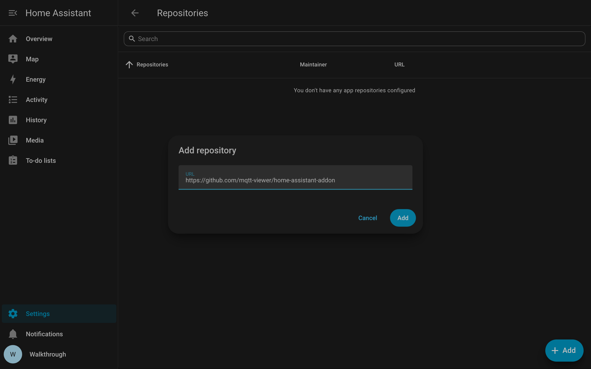
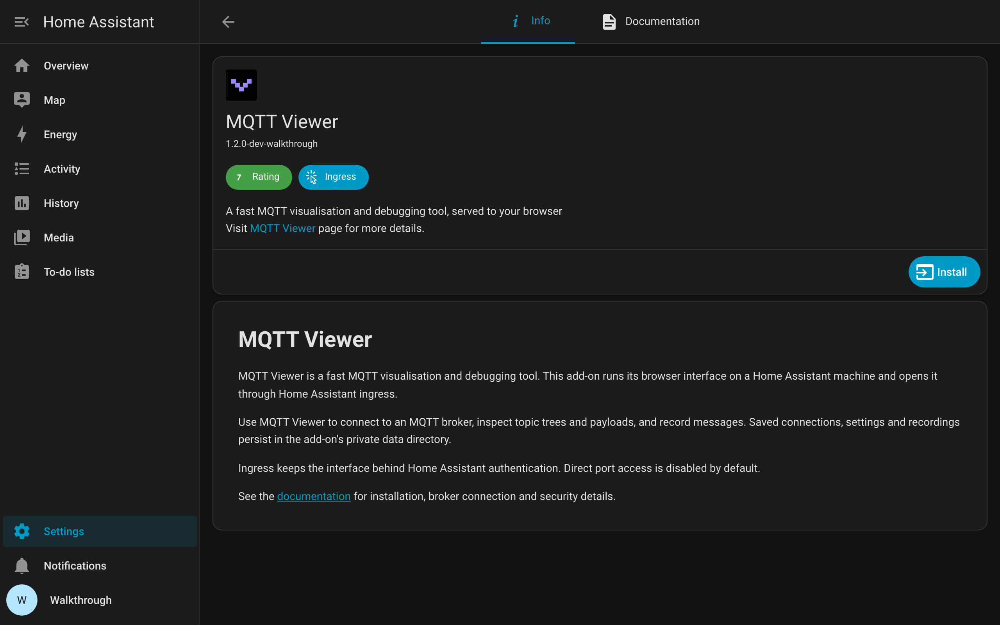
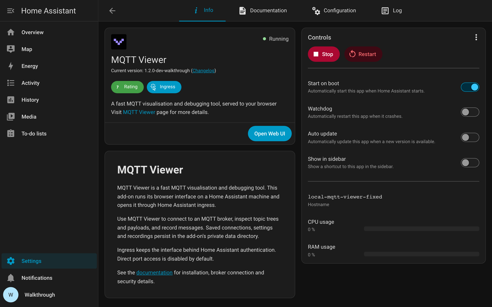
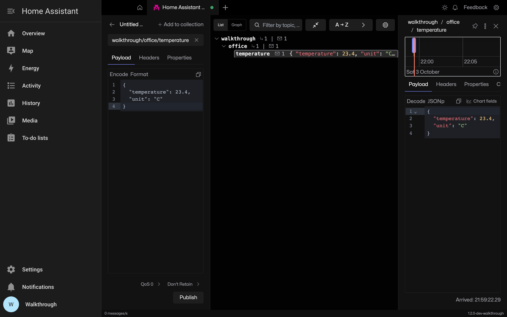

# MQTT Viewer Home Assistant add-on

Run [MQTT Viewer](https://github.com/mqtt-viewer/mqtt-viewer) on your Home
Assistant machine and use it through Home Assistant ingress.

This add-on builds a small wrapper around `ghcr.io/mqtt-viewer/mqtt-viewer`
at the version pinned in [mqtt-viewer/config.yaml](mqtt-viewer/config.yaml). Each MQTT Viewer
release bumps that pin automatically, so the add-on tracks the app.

## Installation walkthrough

Use Home Assistant OS with administrator access and the **Mosquitto broker**
app installed and running. Have your broker username and password ready.
Home Assistant Container does not include the app store used here.

The screenshots show a locally packaged MQTT Viewer 1.2 prerelease on Home
Assistant OS 18.3 and Core 2026.9.4. The installed version follows the release
pinned in the configuration linked above.

### 1. Add the repository

[](https://my.home-assistant.io/redirect/supervisor_store/?repository_url=https%3A%2F%2Fgithub.com%2Fmqtt-viewer%2Fhome-assistant-addon)

Or open **Settings**, **Apps**, then **Install app**. Open the three-dot menu,
choose **Repositories**, select **Add** and paste this address. Select **Add**
again to save it.

```text
https://github.com/mqtt-viewer/home-assistant-addon
```



### 2. Install MQTT Viewer

Find **MQTT Viewer** in the app store, open it and select **Install**.
Wait for installation to finish.



### 3. Open the web UI

Select **Start**, then **Open Web UI** once the app is running. Home Assistant
serves the interface through ingress and requires Home Assistant authentication.
Leave direct host port access disabled; ingress does not need it.



### 4. Connect to Mosquitto

In MQTT Viewer, add a connection. Set the host to `core-mosquitto`, port `1883`
and enter your broker credentials. Add a `walkthrough/#` subscription, then
connect.

`core-mosquitto` refers to the Mosquitto app inside Home Assistant. A desktop
MQTT client uses the Home Assistant machine's address instead.

### 5. Publish and check a message

Click **New message**, enter `walkthrough/office/temperature` as the topic and
paste this payload, then click **Publish**:

```json
{"temperature":23.4,"unit":"C"}
```

Expand **walkthrough** and **office** in the topic tree, then select
**temperature**. The received payload should show `23.4` and `C`.



MQTT Viewer's broker-status device-monitoring control is hidden in browser
mode, including this add-on.

Full instructions and security notes are in
[mqtt-viewer/DOCS.md](mqtt-viewer/DOCS.md).

## Issues

App bugs and feature requests belong in the
[main repository](https://github.com/mqtt-viewer/mqtt-viewer/issues).
Packaging problems with this add-on can be filed here. Please let me know if you have any issues.
